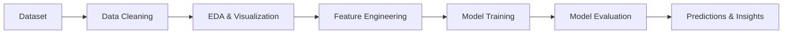

# 🚀 Machine Learning Mini Project

> Turning raw data into meaningful predictions, one notebook cell at a time.


---

## 🌟 Project Overview

Data tells stories. This project is an exploration of those stories through the lens of **Machine Learning**.

Using a dataset and Jupyter Notebook, this project walks through the complete ML pipeline:

🔍 Data Exploration  
🧹 Data Cleaning & Preprocessing  
📊 Visualization & Insights  
⚙️ Feature Engineering  
🤖 Model Training  
📈 Performance Evaluation  

The goal is simple: transform raw data into actionable insights and accurate predictions.

---

## 🎯 Objectives

- Understand the dataset and discover hidden patterns
- Clean and prepare data for machine learning
- Train and evaluate multiple ML models
- Compare model performances
- Generate meaningful insights from the results

---

## 🛠️ Tech Stack

| Technology | Purpose |
|------------|----------|
| 🐍 Python | Core Programming |
| 📓 Jupyter Notebook | Development Environment |
| 🐼 Pandas | Data Manipulation |
| 🔢 NumPy | Numerical Computing |
| 📊 Matplotlib / Seaborn | Data Visualization |
| 🤖 Scikit-learn | Machine Learning Models |

---

## 📂 Project Structure

```text
📦 Machine-Learning-Mini-Project
│
├── 📓 project.ipynb
├── 📊 dataset.csv
├── 📁 images
├── 📄 README.md
└── 📋 requirements.txt
```

---

## 🔬 Machine Learning Workflow



---

## 📈 Key Highlights

✨ Comprehensive Data Analysis

✨ Interactive Visualizations

✨ Data Preprocessing Pipeline

✨ Machine Learning Model Development

✨ Model Performance Comparison

✨ Reproducible Workflow in Jupyter Notebook

---

## 📊 Results

The trained model(s) were evaluated using appropriate performance metrics to measure prediction accuracy and reliability.

Example Metrics:
- Accuracy
- Precision
- Recall
- F1 Score
- Mean Squared Error (depending on project type)

> The best-performing model was selected based on evaluation results.

---

## 🚀 Getting Started

### Clone the Repository

```bash
git clone https://github.com/your-username/your-repository-name.git
```

### Navigate to Project Directory

```bash
cd your-repository-name
```

### Install Dependencies

```bash
pip install -r requirements.txt
```

### Launch Jupyter Notebook

```bash
jupyter notebook
```

---

## 📷 Sample Workflow

```text
Raw Data
   ↓
Clean Data
   ↓
Visual Analysis
   ↓
Feature Selection
   ↓
Model Training
   ↓
Evaluation
   ↓
Predictions
```

---

## 💡 Future Improvements

- Implement advanced ML algorithms
- Hyperparameter tuning
- Model deployment using Flask/Streamlit
- Real-time prediction interface
- Automated ML pipeline

---

## 🤝 Contributions

Contributions, suggestions, and improvements are always welcome.

If you find this project useful:

⭐ Star the repository  
🍴 Fork it  
📢 Share it  

---

## 📜 License

This project is open-source and available under the MIT License.

---

<div align="center">

### 🌌 "Data is the new fuel, Machine Learning is the engine."

Built with ❤️, curiosity, and countless notebook cells.

</div>

